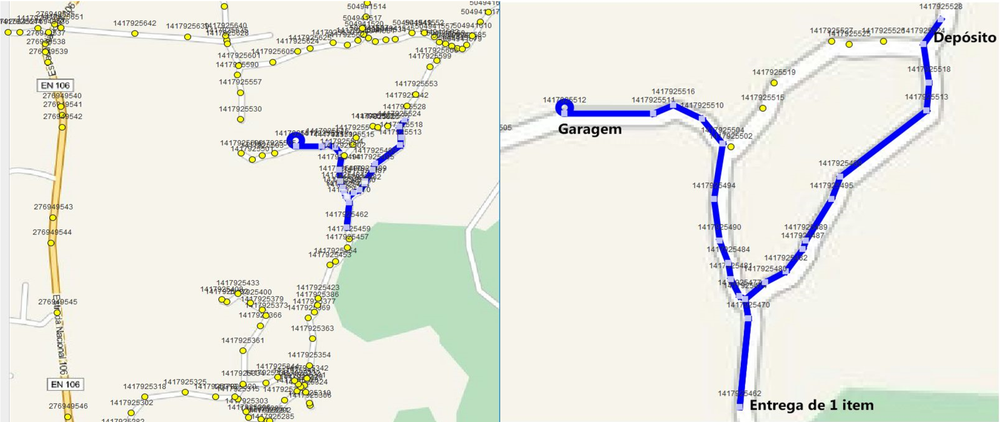
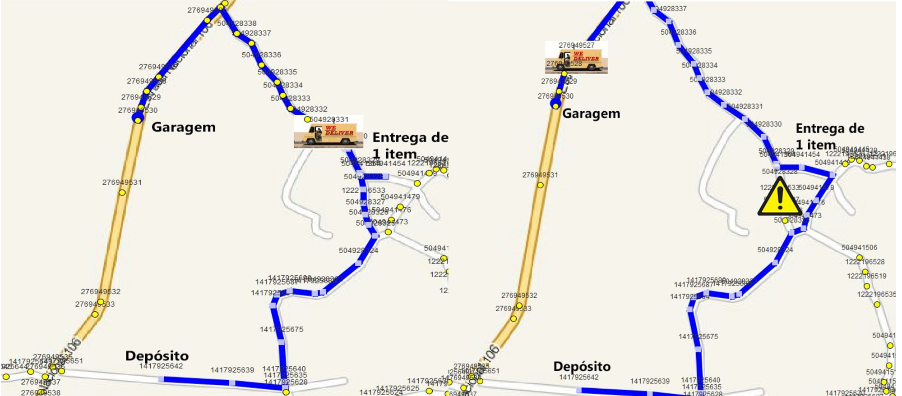
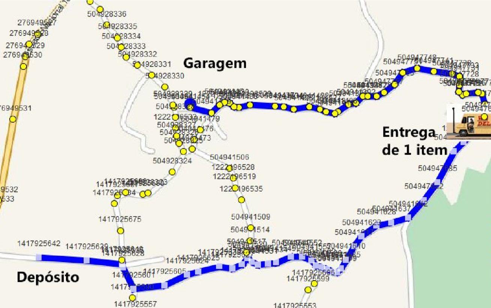

# CAL Algorithm Design and Analysis
Projects made in Algorithm Design and Analysis class - MIEIC 2y2s

## Project 1
This project had us develop a solution for a goods distribution company that would make it possible for the company to manage its fleet and its deliveries. The items of the deposit are identified with the name of recipient's name, each item's content value, item volume, destination, invoice number and any other information deem important.
The company has a fleet of vans of different volume capacity. This application can show the path for each van to take in order to minimize the path to take from the deposit to the garage, going through the delivery points. The path has to take into account possible road blocks or construction sites that can be added to the map.
The maps were real maps, extracted from OpenStreetMaps (www.openstreetmap.org).

## Project 2
In the second part of the project, the application had to allow to search between the items to be delivered by a van, the client by searching using his name. It also allows to identify how many items addressed to a certain street, identified by its name, ex: "Rua de Dr Roberto Frias".

Shortest path example

Blocked road example

One way road example

